# はじめてのIkaLog GUI版

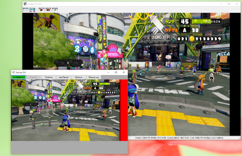

現在 Dropbox などからアルファ版スナップショットを公開しています。


## IkaLog って何ができるの

任天堂の WiiU 用ソフト「スプラトゥーン」の画面をリアルタイム解析して、
いろいろなことができるソフトです。

- 勝ち／負け、ステージ、ルールを時系列にログファイルへ蓄積
- マッチ終了時のスクリーンショットを保存
- Twitter, Slack, stat.ink にプレイ状況をリアルタイム投稿
- アマレコTV, OBS などの録画ソフトの録画開始・停止を自動制御、ファイルをリネーム

動作原理を知りたい方は [「スプラトゥーン」リアルタイム画像解析ツール 「IkaLog」の裏側 ](http://www.slideshare.net/TakeshiHasegawa1/20151016ssmjpikalog) まで。

## (参考) IkaLog GUI 版とコマンドライン版の違い

IkaLog は <https://github.com/hasegaw/IkaLog> にてホストされている
オープンソースソフトウェアです。

IkaLog GUI 版 (IkaUI) は IkaLog をウインドウアプリとして動くように
したバージョンです。

#### GUI版のみにある機能

- Windows 用 EXE アプリケーションになっているので簡単に使える
- タイムライン表示が可能（Experimental)
- 設定が画面上でできる

#### コマンドライン版にのみあり、現在 GUI では使えない機能

すべての IkaLog の機能はまだ実装されていません。必要であればコマンドライン版を検討してください。

- Fluentd 連携 (データベースやWebサービスに戦績を投稿)
- Hue (Phillips製フルカラーLED電球)にチーム色を設定
- キャプチャボードの表示ズレ対策 (IkaInput_CVCapture.offset)
- そのほか自分でプラグインを自由に追加可能
- [自分の Python スクリプトから IkaLog を利用する (Embedded IkaLog)](EmbeddedIkaLog.md)
- etc...

<br>
## IkaLog の入手方法

公開 URL からファイルをダウンロードします。最新版はこちら:

<https://dl.dropboxusercontent.com/u/14421778/IkaLog/download.html>

<br>
## はじめての設定

IkaLog をはじめて使う場合は、 IkaUI.exe を起動して設定を行ってください。

### 入力ソースの準備

IkaLog を利用する前に、WiiU の画面を HDMI キャプチャできる環境を
構成してください。

- [HDMI キャプチャ機器の選び方について](https://github.com/hasegaw/IkaLog/wiki/CaptureDevices)
- [IkaLog Store](http://d.ballade.jp/2015/10/IkaLogStore.html)

#### アマレコTV を使っている場合

アマレコTVをご利用の方は、アマレコTVのライブ機能を設定すると、
アマレコTVで表示している内容をIkaLogや配信ソフトが利用できるようになるので、
ライブ機能を使うのがオススメです。

ライブ機能を使う場合は、下記の設定を行います。

- ライブ機能を使う をチェック
- フレームレートの目安を 30fps （以上）に設定
- ビデオ設定内の「リサイズ」 1280x720 に設定

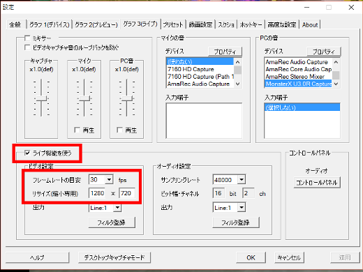

### 起動

IkaUI.exe を実行します。すると IkaLog のウインドウが表示されます。

まずはキャプチャの設定を行わないと画面が見えません
（ただしアマレコのライブ機能がオンであり、
かつアマレコから画面が出力されている場合は
初回起動時でもキャプチャ画面が見えるはずです）。

### はじめての設定

IkaLog ウインドウの Options ボタンをクリックします。
最低限、下記の設定をおすすめします。

- Input: 入力ソースを選ぶ
- CSV: ログファイル出力有効化
- JSON: ログファイル出力有効化
- Screenshot: スクリーンショット保存の有効化

具体的な設定方法は本ページの「設定」セクションをご覧ください。

設定を変更したら Apply ボタンを押して反映してください。 Apply ボタンを押したときに、全オプションタブの変更内容がまとめて反映されます。

設定が完了したら、念のため IkaLog を一度再起動してからご利用ください。

### 動作確認

IkaUI.exe を起動し、プレビューが映っていることを確認して、
スプラトゥーンをプレイします。
マッチ終了後に CSV/JSON ファイルが更新されていれば、正しく動作しています。

<br>
## 設定項目

### Input (入力ソースの設定)

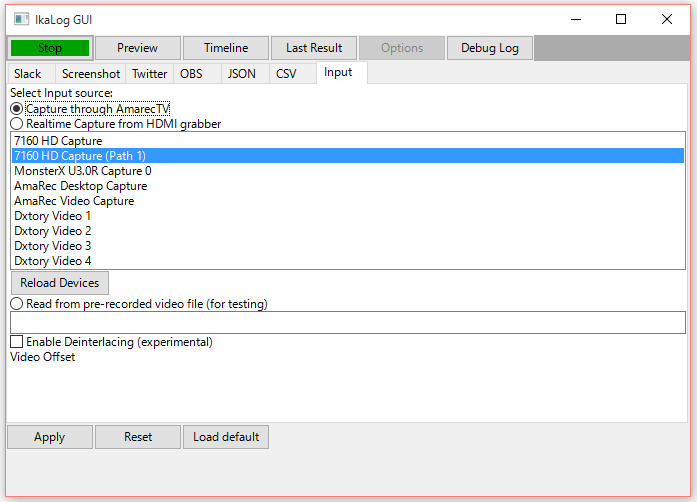

IkaLog は現在下記3タイプの入力が可能です。

| ラジオボタン | 説明 |
|--------------|------|
|Capture through AmarecTV|アマレコのライブ機能を経由してキャプチャします(デフォルト)|
|Realtime Capture from HDMI grabber|HDMI キャプチャデバイスを経由してキャプチャします|
|Read from pre-recorded video file (for testing)|録画済みのビデオファイルを再生します|

##### アマレコTVのライブ機能を介して入力する

Capture through AmarecTV のラジオボタンを選択すると、アマレコTVのライブ機能から出力されている画面を入力ソースとして利用します。

##### キャプチャデバイスを指定する

Realtime Capture from HDMI Grabber のラジオボタンを選択し、
キャプチャデバイスを選択します。

- コンピュータに接続しているキャプチャデバイスがただしく表示されていない場合、 IkaLog 起動後に USB3.0 のキャプチャデバイスを新たに接続した場合は Reload Devices ボタンをクリックしてみてください。
- キャプチャデバイスとして Input Device 1〜10 が表示される場合、 IkaLog がキャプチャデバイスの取得に失敗しています。

##### ファイルを指定する

Read from pre-recorded video file (for testing)
ラジオボックスを選択し、下の枠にファイル名を入力すると、
指定された動画ファイルを入力ソースとして利用できます。
普段使うことはないかと思いますが、
ガチヤグラ／ホコのグラフを書いたりするときに使えるかもしれません。

### Screenshot ()スクリーンショット保存の設定)

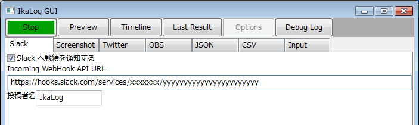

マッチ終了時に自動的に戦績画面（K/Dが表示されている画面）のスクリーンショットを
保存します。

##### 設定方法

- 必要に応じてスクリーンショットの保存先ディレクトリを指定してください。

- CSV/JSON タブの保存先ファイルを設定してください。
- 戦績画面のスクリーンショットを保存する をチェックしてください。
- Miiverse 投稿の保存機能はチェックしても動作しません（未実装です）

上記操作により、マッチ終了時にファイルが追記されていくようになります。


### CSV, JSON 出力の設定


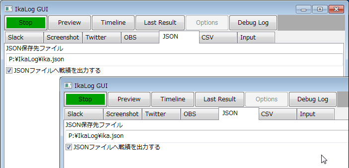

CSV, JSONのタブでは各形式でのログファイル出力の設定を行います。

##### ファイルフォーマット

CSVファイルは下記のフォーマットで出力されます。
CSV ファイルは Excel などのソフトウェアで開けるため、
そういったツールで戦績を整理する場合に便利です。
````
1439893079,2015,08,18,19,17,Bバスパーク,ナワバリバトル,勝ち
(unix time,yyyy,mm,dd,HH,MM,stage_name,rule,result)
````

JSONファイルは下記のフォーマットで出力されます。
JSON ファイルは独自にプログラムを書いて戦績データを
処理したいときに便利です。

````
{"map":"\u30de\u30b5\u30d0\u6d77\u5ce1\u5927\u6a4b","rule":"\u30ac\u30c1\u30a8\u30ea\u30a2","event":"GameResult","result":"win","time":1442665058}
````

##### 設定方法

- CSV/JSON タブの保存先ファイルを設定してください。
- ファイルへ戦績を保存する をチェックしてください。

上記操作により、マッチ終了時にファイルが追記されていくようになります。

### OBS (録画の自動起動／停止)


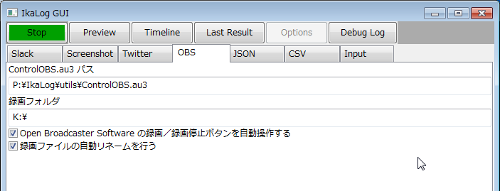


IkaLog は、次のタイミングで録画を自動起動したり、停止させることができます。

| 操作 | タイミング |
|------|------------|
|録画開始|ロビーのマッチングで8人そろった時点|
|録画終了|マッチが終わった時点（K/Dが表示された時点)|

実際には、上記タイミングで外部プログラムを読んでいるだけです。

#### 付属の自動録画開始／停止スクリプトを使うには

付属の連携スクリプトは AutoIT を使って作られています。
（AutoIT を使うと Windows 上で他のアプリケーションを操作するスクリプトが
比較的簡単に作れます。）

これらの IkaLog からこれらのスクリプトを利用するためには、
AutoIT をあらかじめインストールしておく必要があります。

<https://www.autoitscript.com/site/autoit/>

#### 付属の録画開始／停止スクリプトについて　

現在下記ふたつのスクリプトを同梱しています。

| スクリプト名 | 内容 |
|-------------|-----|
| utils\ControlAmarecTV.au3 | アマレコTVで録画開始／終了する |
| utils\ControlOBS.au3 | Open Broadcaster Software で録画開始／終了する |


- IkaLog が録画終了するタイミングが、K/Dが表示されたタイミングなので、その場ですぐに録画を終了してしまうと戦績画面が完了する前に録画がとまってしまいます。このため、これらのスクリプトはしばらく間を置いてから録画を停止するようになっています。
- ControlOBS.au3
 - 開始／停止のタイミングでウインドウ上の録画ボタンをクリックしています。
 - IkaLog のシーン検出誤動作で録画しっぱなしになってしまう場合は、 OBS をプレビュー状態にしておくと、とりあえず録画が開始されることを抑止できます。
- ControlAmarecTV.au3
 - 開始／停止のタイミングで AmarecTV のショートカット Ctrl-Z を押したことにしています。
 - アマレコTV の録画状態がスクリプト上から取得できていないため、下記の前提で動作します。
  - 録画開始するときは、その時点で録画されていない前提  
  - 録画終了するときは、その時点で録画中の前提

#### 設定方法

OBS タブを開き、ControlOBS.au3 パスを設定してください。アマレコで利用する場合は
 ControlOBS.au3 を ControlAmarecTV.au3 に書き換えてください。

 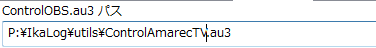

#### 自動リネーム機能

IkaLog 、およびこれらのスクリプトは、録画完了後にファイルを自動リネームする機能を持っています。仕組みは下記のとおりです。
- IkaLog が下記の環境変数表のとおり設定してスクリプトを起動します。
- ControlOBS(AmarecTV).au3 は録画終了後に、録画ファイル保存ディレクトリの最新の MP4(AVI) ファイルを、 IkaLog が指定したファイルにリネームします。

この仕組みのため、録画フォルダに録画ファイルがきちんと保存されていない場合、
そのフォルダにある、もっとも新しいMP4/AVIファイルが最新の録画だと誤認識し
リネームします。自動リネーム機能の利用にあたって認識しておいてください。

| 環境変数 | 説明 | 例 |
|---------|------|----|
|IKALOG_MP4_DESTDIR|録画ファイルが保存されるディレクトリ|"K:\"|
|IKALOG_MP4_DESTNAME|最新の録画ファイルにつける名前| "K:\20150919_2134_マサバ海峡大橋_ガチエリア_win.mp4"|

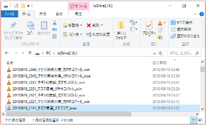


### Twitter 連携

マッチ終了時に、マッチの結果を Twitter にポストできます。

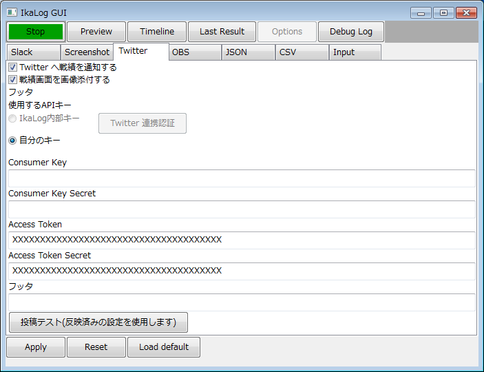

#### 設定方法

- Options パネルの Twitter タブを開きます。
- IkaLog 内部キー のラジオボックスを選択します。
- Twitter 連携認証ボタンをクリックします。
- OAuth URL が表示されますので、これをブラウザにコピー＆ペーストします。
- ブラウザ上で Twitter のアプリ認証を行います。
- ブラウザ上に PIN コードが表示されます。
- IkaLog の PIN コード入力ダイアログで PIN を入力します。
- 設定画面の AccessToken, AccessTokenSecret が入力されれば成功です。
- Twitter へ戦績を投稿する をチェックします。
- 必要に応じて「戦績画面を画像添付する」をチェックします。

#### テスト方法

Twitter に本当に投稿できるかは、投稿テストボタンを押して確認できます。
投稿テストは、ボタンを押した時点でアクティブな設定を使って行いますので、
事前に Apply ボタンを押して設定を確定してください。

#### 自分の ConsumerSecret/ConsumerKey を利用する場合

IkaLog 内部キーが利用できない場合、
自分で ConsumerSecret, ConsumerKey, AccessToken, AccessTokenSecret
を準備できる場合は、直接それらの値を入力できます。

<https://dev.twitter.com/>

#### Twitter 投稿例
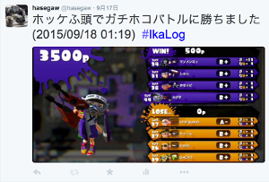

#### セキュリティ上の注意

IkaConfig.yaml ファイルに Twitter の認証情報が平文で保存されますので、
ファイルをアップロードしたり他人に共有しないように注意してください。

### Slack 連携


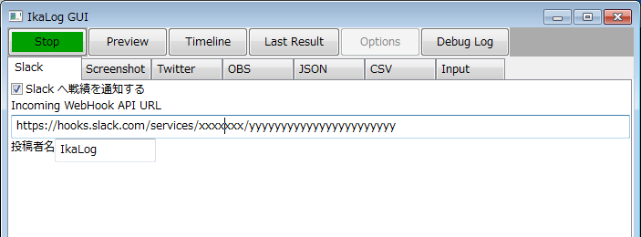

マッチ終了時に、マッチの結果を Slack の Incoming Web Hook にポストできます。

- Options パネルの Slack タブを開きます。
- Incoming API WebHook に、 Slack 上で取得した URL を入力します。
- 必要に応じて投稿者名を修正します。
- Slack へ戦績を投稿する をチェックします。

#### Slack投稿例
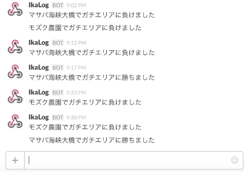


### stat.ink 連携

(stat.ink)[https://stat.ink/] とは、スプラトゥーンのプレイ状況をシェアできる
Web サイトです。

IkaLog は、 stat.ink の API 仕様に準拠した投稿プラグインを搭載しています。
オンにすることで Web サイトに戦績を投稿し、ブラウザ経由でステージごと／ルールごとの
絞り込み表示などが可能になります。

IkaLog のブキ認識機能（実験中）も利用できますが、正答率があまり高くありません
（手元で 97% 程度）しかありませんので、それを承知の上ご利用ください。

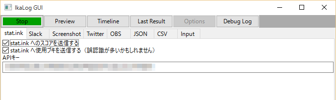

- Options パネルの stat.ink タブを開きます。
- stat.ink で取得した API キーを入力します。
- stat.ink へのスコアを送信する をチェックします。
- stat.ink へ使用ブキを送信する を必要に応じてチェックします。

## FAQ

### プレビューに WiiU の画面が映っているが、なにも反応しない

HDMIキャプチャの内容がプレビューに映っていても何も反応しない場合、
WiiU の設定にて画面が縮小されている可能性があります。

これは、テレビによって表示される範囲が違うために調整するための機能ですが
IkaLog では縮小された状態での動作は想定していません。

WiiU ホーム画面からレンチのアイコンを選び、以下の設定を見直してください。

```
テレビ＞画面の大きさを調整する
```

画面サイズをできるだけ最大にします。（私が使っているキャプチャデバイスでは横に線がでていますが、多くのデバイスではふちまで表示されると思います）

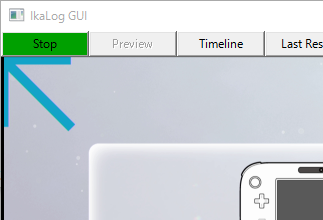

以下のように黒枠がついている状態では認識しなかったり、認識に失敗する場合があります。

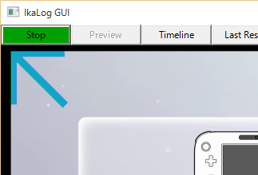


### IkaLog を動かしたら OS がクラッシュした

Windows 上でビデオキャプチャデバイスを使用するとき、（特に使用開始・停止したとき、
複数のアプリケーションから同じキャプチャデバイスを使用しようとしたときなどに）
Windows が OS ごとクラッシュすることがあります。原因はよくわかりませんが
DirectShow や、キャプチャデバイスのドライバ側での排他制御がおかしいのだと思われます。

IkaLog 側で問題解消することはできませんのでデバイス製造元などに相談してください。


### IkaLog 終了時にアプリケーションエラーが発生する

原因調査中ですが実用上問題はないようです。


### ブキ、ランク、ウデマエ、K/Dなどを誤認識する、反応しない、過剰反応する

「動いているけどもブキ認識だけいつも失敗する」という方はおそらくキャプチャカードの
仕様で画面の表示位置が全体的にずれています。
また、画面表示が左右・上下に数ドット分ずれて入力されるものがあるようです。
画面ズレがあるものは現在 IkaUI で対応していません。

これらの画像／文字認識データはほぼすべて IkaLog 開発者の環境のスクリーンショットを
ベースに作成しています。実戦での登場頻度によって認識用データの精度にばらつきがあります。

また、キャプチャデバイスからの入力データは色合い・コントラスト・ブライトネス、
ハードウェアエンコード対応器では画質の劣化もあり、 IkaLog が受け取るデータは
環境ごとに異なります。
できるだけ多くの環境をカバーできるように調整していますが完璧ではありません。

認識率が低い、反応が悪いなどの問題がある場合は Dropbox, Google Drive などにデータを置いて
教えてください。 screenshots/ に自動保存されたデータもしくはアマレコなどで保存した
非劣化状態のファイルをお願いします。お送りいただいたものをベースにモデルに追加します。

ハードウェアエンコード仕様の HDMI キャプチャデバイスの場合はできるだけ画像品質を
高い状態にしてデータを取得してください。


### 「明らかに IkaLog の動きがおかしいのでデータを送ります」

使用するHDMIキャプチャによって入力内容が変わったり、バグレポートなどをいただけるのは
歓迎します。ただ、IkaLog の高機能化などもあって問題レポートも増えつつあり
整理したり消化する側としてもけっこう大変です。

バグ情報については下記の方針でお知らせください。

バグにあたって必要な情報
- 問題が起きているシーン（例：ナワバリロビーでマッチング中、死亡したタイミング、など）
- 正しい状態がどうなのか（元気に生きているが）
- どうなってしまったか（死んだことになってしまった）
- 使用している IkaLog のバージョン (09f8f94_20151008_030558_WinIkaLog）
- 再現はどれぐらいするのか

### フライトレコーダー機能について

現在の IkaLog には簡易フライトレコーダー機能がついています。設定画面の
DebugVideo タブで「録画開始」を押してから「録画終了」を押すまで、 IkaLog が
解析したビデオフレームが Motion JPEG 形式で保存されており、そのタイミングの
IkaLog の動作が再現できます。

先のリストにある情報の追加情報として、フライトレコーダーの録画データを
いただければ問題を解析が楽になることもありますが、
なお、フライトレコーダーのデータ一方的に投げつけるような行為はやめてください。
データは大きく送る方も受け取って内容を確認するほうも大変です。
1GBのデータを10本受け取ったら、チェックする側は10GB分のデータを抱えます。

フライトデコーダー機能のファイル圧縮効率はあまりよくありません。
この機能にこだわらなくても、
FFMPEG で H.264 720p 3Mbps 以上のデータであればだいたいの場合十分な画質で
調査に使えますので、アマレコや OBS などの録画でもあまり劣化せずに
十分な解析に使えますので、そういった方法で不具合が発生している前後の
動画をとってもOKです。


<br>
## 謝辞

IkaLog の開発にあたって多くの方々のご協力をいただいております。ありがとうございます。

- コントリビュータの皆さん
  - @ExceptionError
  - @itoooon
  - @kshimo69
  - @mzsm_j

- IkaLog と連携するサービスを提供していただいている方
  - @fetus_hina ([stat.ink](http://stat.ink))

- そのほか各種バグ報告や、修正案、方向性の検討について様々な方から意見やアイデアをいただいた方々
  - @apricot385
  - @mntone

- IkaLog に関して Twitter で投稿されている方々 (おかげでバグや環境依存の問題などを見つけて修正できています)

- Splatoon を一緒にプレイしてくれる方々
- Splatoon を作った方々
